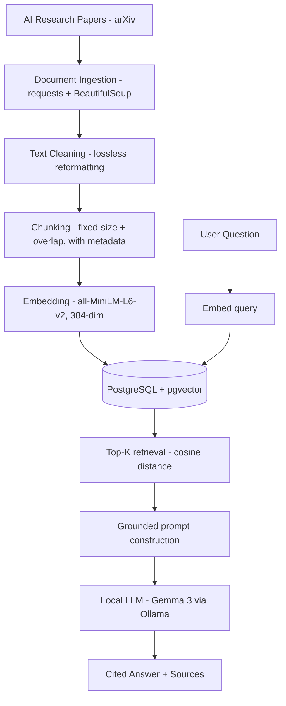

# RAG Research Assistant 📚

> An end-to-end **local** Retrieval-Augmented Generation system that answers questions about foundational AI research papers — grounded in the source text, with citations, no API keys, built phase by phase.

[](https://www.python.org/)
[]()
[]()
[-black.svg)]()
[]()

RAG Research Assistant ingests AI research papers, embeds them into a semantic
search space stored in PostgreSQL + pgvector, retrieves the most relevant
passages for any natural-language question, and uses a local LLM to generate a
grounded, cited answer. It runs **entirely on-device** — no API keys, no
per-call cost.

It is built with a **production-oriented mindset**: every layer is understood,
every design choice is justified, and every planned improvement will be
**measured** rather than assumed beneficial. The project is built **phase by
phase** — each phase is a self-contained, testable milestone, reflected in the
commit history.

---

## ✨ Key Features

| Feature | Description |
| --- | --- |
| **Clean ingestion** | Fetches papers from arXiv's ar5iv HTML and extracts article text with BeautifulSoup |
| **Lossless cleaning** | Only information-preserving reformatting; math and references deliberately untouched |
| **Overlapping chunking** | ~1000-char chunks with ~150-char overlap so context isn't lost at boundaries |
| **Semantic embeddings** | 384-dim vectors via `all-MiniLM-L6-v2`, fully local and zero-cost |
| **Persistent vector store** | Embeddings stored once in **PostgreSQL + pgvector**; retrieval queries the DB (no re-embedding per run) |
| **Source-aware retrieval** | Cosine-distance search (`<=>`) returning top-K passages with paper + chunk metadata |
| **Grounded generation** | Local **Gemma 3 (Ollama)** answers using only retrieved context, with `[Source N]` citations and "I don't know" handling |
| **Honest evaluation** | Real retrieval failure modes documented in `sample_output.md`, not hidden |
| **Reranking + hybrid retrieval** *(planned)* | Cross-encoder reranking and BM25 + dense search, validated against metrics |

---

## 🏗️ Architecture



---

## 🔍 Example

> **Question:** *What is multi-head attention?*

**Generated answer (local Gemma 3, grounded in retrieved chunks):**

> Multi-Head Attention consists of several attention layers running in parallel [Source 2]. Instead of performing a single attention function with d-dimensional keys, values, and queries, it linearly projects them h times with different, learned linear projections. This allows the model to jointly attend to information from different representation subspaces at different positions [Source 2].

**Sources used:**

| Source | Paper | Chunk | Similarity |
| --- | --- | --- | --- |
| 1 | attention | 51 | 0.611 |
| 2 | attention | 14 | 0.589 |
| 3 | attention | 50 | 0.586 |

Notably, the actual definition was retrieved at **rank 2**, not rank 1 — yet the
LLM correctly drew its answer from that source and ignored the two noisier
chunks. This robustness, and the baseline's retrieval ranking imperfections, are
documented in **[`sample_output.md`](sample_output.md)** and are the measurable
targets for the planned reranking and structure-aware chunking improvements.

---

## 📚 Corpus

| Paper | arXiv ID |
| --- | --- |
| Attention Is All You Need | 1706.03762 |
| BERT: Pre-training of Deep Bidirectional Transformers | 1810.04805 |
| Retrieval-Augmented Generation for Knowledge-Intensive NLP Tasks | 2005.11401 |
| Language Models are Few-Shot Learners (GPT-3) | 2005.14165 |

> Paper texts are **not committed**. Run `python ingest.py` to fetch and build the corpus from source.

---

## 📁 Project Structure

```text
rag-research-assistant/
├── ingest.py            # fetch, extract, lossless-clean papers → data/
├── chunk.py             # chunk cleaned text (importable: get_all_chunks)
├── embed.py             # in-memory embedding + retrieval (early baseline)
├── store.py             # embed once + persist all chunks to pgvector
├── retrieve.py          # query pgvector for top-K similar chunks
├── generate.py          # build grounded prompt + local LLM answer with citations
├── requirements.txt
├── sample_output.md     # real retrieval output + analysis
├── README.md
├── .env                 # DB credentials (gitignored)
└── data/                # generated by ingest.py (gitignored)
```

---

## 🚀 Getting Started

### Prerequisites

- Python 3.11
- PostgreSQL 17 with the [pgvector](https://github.com/pgvector/pgvector) extension
- [Ollama](https://ollama.com) with a local model pulled (`ollama pull gemma3:4b`)
- Internet access on first run (fetches papers + downloads the embedding model once)

### Setup

```bash
git clone https://github.com/HarshaKoushikTeja/rag-research-assistant.git
cd rag-research-assistant
python -m venv venv
venv\Scripts\activate          # Windows  (use: source venv/bin/activate on macOS/Linux)
pip install -r requirements.txt
```

### Configure the database

```sql
CREATE DATABASE rag_assistant;
\c rag_assistant
CREATE EXTENSION vector;
CREATE TABLE chunks (
    id SERIAL PRIMARY KEY,
    paper TEXT NOT NULL,
    chunk_index INTEGER NOT NULL,
    content TEXT NOT NULL,
    embedding vector(384)
);
```

Then create a `.env` file (gitignored) with your connection details:

```text
DB_HOST=localhost
DB_PORT=5432
DB_NAME=rag_assistant
DB_USER=postgres
DB_PASSWORD=your_password
```

### Run the pipeline

```bash
python ingest.py               # fetch + clean papers into data/
python store.py                # embed all chunks once and store in pgvector
python generate.py             # retrieve + generate a grounded, cited answer
```

---

## 🧩 Pipeline Components

### 1. Document Ingestion — `ingest.py`
- Downloads paper content from ar5iv HTML renderings
- Extracts article text with BeautifulSoup (drops scripts, styles, nav, footer)
- Applies **lossless** cleaning: tidies citation brackets split across lines, collapses redundant blank lines
- Preserves research content; does not strip math or reference noise (see *Design Decisions*)

### 2. Chunking — `chunk.py`
- Splits papers into ~1000-character chunks with ~150-character overlap
- Stores per-chunk metadata (`paper`, `index`) for source attribution
- Importable module (`get_all_chunks()`) reused by downstream scripts
- Current corpus: **4 papers, 497 chunks**

### 3. Embedding + Storage — `store.py`
- Embeds all chunks with `all-MiniLM-L6-v2` into 384-dim vectors
- Persists chunks + embeddings to PostgreSQL + pgvector (idempotent: truncates and reloads)
- Credentials loaded from `.env`; parameterized inserts (no SQL injection)

### 4. Retrieval — `retrieve.py`
- Embeds only the query, then ranks stored chunks by cosine distance (`<=>`) in the database
- Returns top-K passages with source metadata and a similarity score

### 5. Generation — `generate.py`
- Builds a grounded prompt: numbered/labeled sources + "use only this context" + "say I don't know" instructions
- Calls local Gemma 3 via Ollama; returns a cited answer plus the sources used

---

## 🧠 Design Decisions

**Local-first throughout.** Local embeddings (`all-MiniLM-L6-v2`) and a local LLM
(Gemma 3 via Ollama) mean zero cost, full privacy, and unlimited free re-runs
during tuning. Both are treated as defensible *baselines* — planned, measurable
upgrades once evaluation exists.

**Fixed-size chunking first.** A simple, robust baseline before introducing
structure-aware or semantic chunking. Each future strategy will be measured
against evaluation metrics rather than assumed beneficial.

**Lossless cleaning only.** Only transformations that provably preserve
information are applied. Aggressive cleaning such as stripping mathematical
notation was deliberately rejected: superscripts mark both footnotes *and* real
exponents, so a blanket strip would destroy content.

**Postgres + pgvector over a bundled vector DB.** Using real PostgreSQL with the
pgvector extension is production-realistic and keeps vectors alongside relational
metadata — enabling future hybrid (structured + semantic) retrieval.

---

## 📊 Observations and Findings

Testing *"What is multi-head attention?"* against the baseline surfaced real
retrieval issues (full output in [`sample_output.md`](sample_output.md)):

- **Ranking errors** — the exact definition did not always rank first. *Planned improvement:* cross-encoder reranking.
- **Bibliography false positives** — reference sections occasionally scored highly due to overlapping academic vocabulary. *Planned improvement:* structure-aware chunking / section filtering.
- **Generation robustness** — despite imperfect ranking, the LLM produced a correct, cited answer from the right source. Whether answers stay strictly faithful to context is exactly what the Phase 2 evaluation will measure.

---

## 🗺️ Roadmap

- [x] **Phase 1 — End-to-End Local RAG** · ingestion · chunking · embeddings · pgvector storage · retrieval · grounded cited generation
- [ ] **Phase 2 — Evaluation Framework** · faithfulness · context precision · answer relevance · retrieval recall
- [ ] **Phase 3 — Retrieval Improvements** · structure-aware chunking · hybrid retrieval (BM25 + dense) · cross-encoder reranking
- [ ] **Phase 4 — Agentic Layer** · tool use · conversational memory · multi-source retrieval
- [ ] **Phase 5 — Production Deployment** · FastAPI service · Docker · observability · dynamic document addition

> Each Phase 3 improvement will be validated against the Phase 2 evaluation harness — measured, not assumed.

---

## 🛠️ Tech Stack

**Language:** Python 3.11
**Embeddings:** sentence-transformers (`all-MiniLM-L6-v2`)
**Vector store:** PostgreSQL 17 + pgvector
**LLM:** Gemma 3 via Ollama (local)
**Ingestion:** requests, BeautifulSoup
**DB access:** psycopg 3, pgvector (Python)
**Planned:** Ragas (evaluation), FastAPI, Docker

---

## 👤 Author

**Harsha Koushik Teja Aila**
MS in Data Science, Analytics & Engineering — Arizona State University

Interested in AI Engineering, Machine Learning, RAG, LLM systems, MLOps, and Software Engineering.

[Portfolio](https://harshaaila.netlify.app) · [LinkedIn](https://www.linkedin.com/in/aila-harsha-koushik-teja) · [GitHub](https://github.com/HarshaKoushikTeja)
