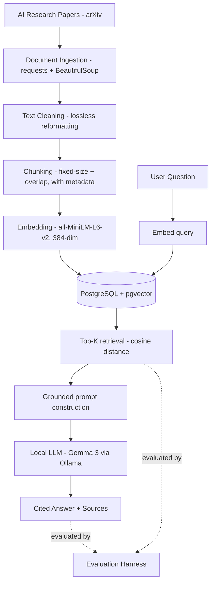

# RAG Research Assistant 📚

> An end-to-end **local** Retrieval-Augmented Generation system that answers questions about foundational AI research papers — grounded in source text, with citations, no API keys — and a **rigorous evaluation harness** to measure and improve it. Built phase by phase.

[](https://www.python.org/)
[]()
[]()
[-black.svg)]()
[]()

RAG Research Assistant ingests AI research papers, embeds them into a semantic
search space stored in PostgreSQL + pgvector, retrieves the most relevant
passages for any question, and uses a local LLM to generate a grounded, cited
answer — entirely on-device, no API keys, no per-call cost. It also ships a
**measurement-first evaluation framework**: every retrieval and generation
behavior is scored, and every planned improvement is validated against a
reproducible baseline rather than assumed beneficial.

The project is built **phase by phase** — each phase is a self-contained,
testable milestone, reflected in the commit history.

---

## ✨ Key Features

| Feature | Description |
| --- | --- |
| **Clean ingestion** | Fetches papers from arXiv's ar5iv HTML and extracts article text with BeautifulSoup |
| **Lossless cleaning** | Only information-preserving reformatting; math and references deliberately untouched |
| **Overlapping chunking** | ~1000-char chunks with ~150-char overlap so context isn't lost at boundaries |
| **Semantic embeddings** | 384-dim vectors via `all-MiniLM-L6-v2`, fully local and zero-cost |
| **Persistent vector store** | Embeddings stored once in **PostgreSQL + pgvector**; retrieval queries the DB |
| **Source-aware retrieval** | Cosine-distance search (`<=>`) returning top-K passages with paper + chunk metadata |
| **Grounded generation** | Local **Gemma 3 (Ollama)** answers using only retrieved context, with `[Source N]` citations and "I don't know" handling |
| **Evaluation harness** | Retrieval metrics (Hit Rate, MRR) + generation confusion matrix + LLM-as-judge faithfulness, over a 30-question labeled set |
| **Reproducibility-aware** | Temperature-0 generation, documented nondeterminism noise band so improvements are judged against signal, not noise |

---

## 🏗️ Architecture



---

## 📊 Evaluation (Phase 2)

A 30-question labeled evaluation set (`eval_set.json`) spans single-paper facts,
specific implementation details, multi-fact, reasoning, cross-paper, and
out-of-scope questions. Every expected answer was verified to exist in the
corpus before labeling.

### Retrieval metrics (top-3)

| Metric | Result |
| --- | --- |
| Hit Rate (correct paper in top-K) | 100% |
| Mean Reciprocal Rank (MRR) | 0.963 |

Hit Rate saturated at 100% — expected, since four topically distinct papers make
*paper-level* retrieval easy. MRR (which is rank-sensitive) exposed the real
weakness: **implementation-detail questions** (e.g. "What optimizer was used?")
rank the wrong paper first, because generic vocabulary like "optimizer" and
"attention heads" is shared across papers.

### Generation metrics — confusion matrix

Generation behavior is framed as a confusion matrix over *should-answer*
(ground truth) vs. *did-answer* (refuse vs. answer):

|  | System answered | System refused |
| --- | --- | --- |
| **Answerable** | ✅ 21 — answered (then faithfulness-scored) | ❌ 5–6 — **false refusals** |
| **Out-of-scope** | ❌ **0 — hallucinations** | ✅ 3 — correct refusals |

- **Zero hallucinations** across all runs — the anti-hallucination prompt holds. The system never fabricates answers to questions outside its corpus.
- **Mean faithfulness ≈ 0.97–0.98** over answered questions (local LLM-as-judge; see caveat below).
- **~5 consistent false refusals** (Q7, Q8, Q9, Q11, Q27): the answer exists in the corpus but the specific chunk wasn't retrieved into the top-K, so the LLM correctly declined. These cluster in exact-term implementation questions (embedding dim, optimizer, warmup, acronym) and cross-paper synthesis — the direct targets for Phase 3.

### Methodology notes

- **Reproducibility.** Generation and the judge run at `temperature=0`. Even so, residual nondeterminism remains (GPU floating-point / batching), producing a **noise band of ~±1 false refusal** between identical runs. Improvements are only treated as real when the delta exceeds this band.
- **LLM-as-judge caveat.** Faithfulness is scored by the local `gemma3:4b` model. A small judge is a *rough* instrument — useful for relative comparison under a fixed judge, but its absolute scores (and occasional sub-1.0 scores on faithful answers) should not be over-interpreted.

---

## 🔍 Example

> **Question:** *What is multi-head attention?*

> **Answer:** Multi-Head Attention consists of several attention layers running in parallel [Source 2]. Instead of performing a single attention function with d-dimensional keys, values, and queries, it linearly projects them h times with different, learned linear projections. This allows the model to jointly attend to information from different representation subspaces at different positions [Source 2].

Full retrieval output and analysis: **[`sample_output.md`](sample_output.md)**.

---

## 📚 Corpus

| Paper | arXiv ID |
| --- | --- |
| Attention Is All You Need | 1706.03762 |
| BERT: Pre-training of Deep Bidirectional Transformers | 1810.04805 |
| Retrieval-Augmented Generation for Knowledge-Intensive NLP Tasks | 2005.11401 |
| Language Models are Few-Shot Learners (GPT-3) | 2005.14165 |

> Paper texts are **not committed**. Run `python ingest.py` to fetch the corpus from source.

---

## 📁 Project Structure

```text
rag-research-assistant/
├── ingest.py                    # fetch, extract, lossless-clean papers → data/
├── chunk.py                     # chunk cleaned text (importable: get_all_chunks)
├── embed.py                     # in-memory embedding + retrieval (early baseline)
├── store.py                     # embed once + persist all chunks to pgvector
├── retrieve.py                  # query pgvector for top-K similar chunks
├── generate.py                  # grounded prompt + local LLM answer with citations
├── evaluate.py                  # retrieval metrics: Hit Rate + MRR
├── eval_generation.py           # generation confusion matrix + faithfulness
├── eval_set.json                # 30-question labeled evaluation set
├── generation_eval_results.json # latest generation eval output
├── requirements.txt
├── sample_output.md             # real retrieval output + analysis
├── README.md
├── .env                         # DB credentials (gitignored)
└── data/                        # generated by ingest.py (gitignored)
```

---

## 🚀 Getting Started

### Prerequisites

- Python 3.11
- PostgreSQL 17 with the [pgvector](https://github.com/pgvector/pgvector) extension
- [Ollama](https://ollama.com) with a model pulled (`ollama pull gemma3:4b`)

### Setup

```bash
git clone https://github.com/HarshaKoushikTeja/rag-research-assistant.git
cd rag-research-assistant
python -m venv venv
venv\Scripts\activate          # Windows  (source venv/bin/activate on macOS/Linux)
pip install -r requirements.txt
```

### Database

```sql
CREATE DATABASE rag_assistant;
\c rag_assistant
CREATE EXTENSION vector;
CREATE TABLE chunks (
    id SERIAL PRIMARY KEY,
    paper TEXT NOT NULL,
    chunk_index INTEGER NOT NULL,
    content TEXT NOT NULL,
    embedding vector(384)
);
```

Create a `.env` (gitignored) with `DB_HOST`, `DB_PORT`, `DB_NAME`, `DB_USER`, `DB_PASSWORD`.

### Run

```bash
python ingest.py               # fetch + clean papers into data/
python store.py                # embed all chunks once and store in pgvector
python generate.py             # retrieve + generate a grounded, cited answer
python evaluate.py             # retrieval metrics (Hit Rate, MRR)
python eval_generation.py      # generation confusion matrix + faithfulness
```

---

## 🧠 Design Decisions

**Local-first throughout.** Local embeddings and a local LLM mean zero cost, full
privacy, and unlimited free re-runs during tuning. Both are defensible
*baselines* — planned, measurable upgrades once evaluation exists.

**Measure before optimizing.** No improvement is adopted on faith. The Phase 2
harness exists so that Phase 3 changes (reranking, hybrid retrieval) can be
proven better against a reproducible baseline, with deltas judged against a
known noise band.

**Fixed-size chunking first.** A simple, robust baseline before structure-aware
or semantic chunking — each future strategy measured, not assumed.

**Lossless cleaning only.** Aggressive cleaning (e.g. stripping math) was
rejected: superscripts mark both footnotes and real exponents, so a blanket
strip would destroy content.

**Postgres + pgvector over a bundled vector DB.** Production-realistic, and keeps
vectors alongside relational metadata for future hybrid retrieval.

---

## 🗺️ Roadmap

- [x] **Phase 1 — End-to-End Local RAG** · ingestion · chunking · embeddings · pgvector storage · retrieval · grounded cited generation
- [x] **Phase 2 — Evaluation Framework** · labeled eval set · Hit Rate + MRR · generation confusion matrix · faithfulness · reproducibility / noise band
- [ ] **Phase 3 — Retrieval Improvements** · hybrid retrieval (BM25 + dense) · cross-encoder reranking · structure-aware chunking — each validated against the Phase 2 baseline
- [ ] **Phase 4 — Agentic Layer** · tool use · conversational memory · multi-source retrieval
- [ ] **Phase 5 — Production Deployment** · FastAPI service · Docker · observability · dynamic document addition

---

## 🛠️ Tech Stack

**Language:** Python 3.11
**Embeddings:** sentence-transformers (`all-MiniLM-L6-v2`)
**Vector store:** PostgreSQL 17 + pgvector
**LLM:** Gemma 3 via Ollama (local)
**Ingestion:** requests, BeautifulSoup · **DB access:** psycopg 3, pgvector
**Planned:** BM25 (hybrid retrieval), cross-encoder reranker, FastAPI, Docker

---

## 👤 Author

**Harsha Koushik Teja Aila**
MS in Data Science, Analytics & Engineering — Arizona State University

Interested in AI Engineering, Machine Learning, RAG, LLM systems, MLOps, and Software Engineering.

[Portfolio](https://harshaaila.netlify.app) · [LinkedIn](https://www.linkedin.com/in/aila-harsha-koushik-teja) · [GitHub](https://github.com/HarshaKoushikTeja)
