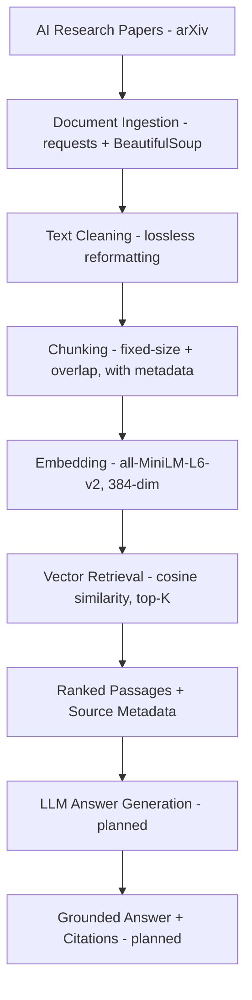

# RAG Research Assistant 📚

> An end-to-end Retrieval-Augmented Generation system that answers questions about foundational AI research papers — grounded in the source text, built phase by phase.

[](https://www.python.org/)
[]()
[]()

RAG Research Assistant ingests AI research papers, embeds them into a semantic
search space, and retrieves the most relevant passages for any natural-language
question. It is built with a **production-oriented mindset**: every layer is
understood, every design choice is justified, and every planned improvement will
be **measured** rather than assumed beneficial.

The project is built **phase by phase** — each phase is a self-contained,
testable milestone. The commit history reflects this.

---

## ✨ Key Features

| Feature | Description |
| --- | --- |
| **Clean ingestion** | Fetches papers from arXiv's ar5iv HTML and extracts article text with BeautifulSoup |
| **Lossless cleaning** | Only information-preserving reformatting (citation tidying, blank-line collapse); math and references deliberately untouched |
| **Overlapping chunking** | ~1000-char chunks with ~150-char overlap so context isn't lost at boundaries |
| **Semantic embeddings** | 384-dim vectors via `all-MiniLM-L6-v2`, fully local and zero-cost |
| **Source-aware retrieval** | Cosine-similarity search returning top-K passages with paper + chunk metadata |
| **Honest evaluation** | Real retrieval failure modes documented in `sample_output.md`, not hidden |
| **LLM answer generation** *(planned)* | Grounded answers with inline citations and "I don't know" handling |
| **Persistent vector store** *(planned)* | pgvector for embed-once storage + dynamic document addition |
| **Reranking + hybrid retrieval** *(planned)* | Cross-encoder reranking and BM25 + dense search, validated against metrics |

---

## 🏗️ Architecture



---

## 🔍 Example Query

> **Question:** *What is multi-head attention?*

The system embeds the query, runs cosine similarity against all chunk
embeddings, and returns the top-ranked passages with source metadata. For this
query, all top results came from *Attention Is All You Need*, and the real
definition of multi-head attention was retrieved at **rank 2**.

The full, unedited retrieval output — including its imperfections and what they
reveal — is documented in **[`sample_output.md`](sample_output.md)**. Those
imperfections are surfaced rather than hidden: they define the measurable
targets for the planned reranking and structure-aware chunking improvements.

---

## 📚 Corpus

| Paper | arXiv ID |
| --- | --- |
| Attention Is All You Need | 1706.03762 |
| BERT: Pre-training of Deep Bidirectional Transformers | 1810.04805 |
| Retrieval-Augmented Generation for Knowledge-Intensive NLP Tasks | 2005.11401 |
| Language Models are Few-Shot Learners (GPT-3) | 2005.14165 |

> Paper texts are **not committed**. Run `python ingest.py` to fetch and build the corpus from source.

---

## 📁 Project Structure

```text
rag-research-assistant/
├── ingest.py            # fetch, extract, lossless-clean papers → data/
├── chunk.py             # chunk cleaned text (importable: get_all_chunks)
├── embed.py             # embed chunks + cosine-similarity retrieval
├── requirements.txt     # direct dependencies
├── sample_output.md     # real retrieval output + analysis
├── README.md
└── data/                # generated by ingest.py (gitignored)
```

---

## 🚀 Getting Started

### Prerequisites

- Python 3.11
- Internet access on first run (fetches papers + downloads the embedding model once)

### Setup

```bash
git clone https://github.com/HarshaKoushikTeja/rag-research-assistant.git
cd rag-research-assistant
python -m venv venv
venv\Scripts\activate          # Windows  (use: source venv/bin/activate on macOS/Linux)
pip install -r requirements.txt
```

### Build the corpus and run retrieval

```bash
python ingest.py               # fetches + cleans the 4 papers into data/
python embed.py                # embeds chunks (chunking runs internally) and runs a sample query
```

### Inspect the chunking step on its own

```bash
python chunk.py                # prints per-paper chunk counts and previews
```

---

## 🧩 Pipeline Components

### 1. Document Ingestion — `ingest.py`
- Downloads paper content from ar5iv HTML renderings
- Extracts article text with BeautifulSoup (drops scripts, styles, nav, footer)
- Applies **lossless** cleaning: tidies citation brackets split across lines, collapses redundant blank lines
- Preserves research content; does not strip math or reference noise (see *Design Decisions*)

### 2. Chunking — `chunk.py`
- Splits papers into ~1000-character chunks with ~150-character overlap
- Stores per-chunk metadata (`paper`, `index`) for source attribution
- Importable module (`get_all_chunks()`) reused by downstream scripts
- Current corpus: **4 papers, 497 chunks**

### 3. Embedding + Retrieval — `embed.py`
- Embeds all chunks and the query with `all-MiniLM-L6-v2` into a shared 384-dim space
- Ranks chunks by cosine similarity and returns the top-K with source metadata

---

## 🧠 Design Decisions

**Local embeddings over an API.** `all-MiniLM-L6-v2` runs locally at zero cost,
enabling unlimited free re-runs during tuning. It is treated as a defensible
*baseline*, not a final choice — the embedding model is a planned, measurable
upgrade once evaluation exists.

**Fixed-size chunking first.** A simple, robust baseline before introducing
structure-aware or semantic chunking. Each future strategy will be measured
against evaluation metrics rather than assumed beneficial.

**Lossless cleaning only.** Only transformations that provably preserve
information are applied. Aggressive cleaning such as stripping mathematical
notation was deliberately rejected: superscripts mark both footnotes *and* real
exponents, so a blanket strip would destroy content. Cosmetic noise that does
not affect retrieval was intentionally left in.

---

## 📊 Observations and Findings

Testing the query *"What is multi-head attention?"* against the baseline
surfaced two real retrieval issues (full output in
[`sample_output.md`](sample_output.md)):

- **Ranking errors** — the exact definition did not always rank first. *Planned improvement:* cross-encoder reranking.
- **Bibliography false positives** — reference sections occasionally scored highly due to overlapping academic vocabulary. *Planned improvement:* structure-aware chunking / section filtering.

These findings provide concrete, measurable targets for the evaluation and improvement phases.

---

## 🗺️ Roadmap

- [x] **Phase 1 — Retrieval Foundation** · corpus selection · ingestion · chunking · embeddings · semantic retrieval
- [ ] **Phase 2 — Evaluation Framework** · faithfulness · context precision · retrieval recall · answer relevance
- [ ] **Phase 3 — Retrieval Improvements** · structure-aware chunking · hybrid retrieval (BM25 + dense) · cross-encoder reranking
- [ ] **Phase 4 — End-to-End RAG** · LLM answer generation · inline source citations · out-of-scope ("I don't know") detection
- [ ] **Phase 5 — Production Deployment** · PostgreSQL + pgvector · FastAPI service · Docker · observability

> Each Phase 3 improvement will be validated against the Phase 2 evaluation harness — measured, not assumed.

---

## 🛠️ Tech Stack

**Language:** Python 3.11
**Embeddings:** sentence-transformers (`all-MiniLM-L6-v2`)
**Ingestion:** requests, BeautifulSoup
**Retrieval:** scikit-learn (cosine similarity)
**Planned:** PostgreSQL + pgvector, FastAPI, Docker, Ragas (evaluation)

---

## 👤 Author

**Harsha Koushik Teja Aila**
MS in Data Science, Analytics & Engineering — Arizona State University

Interested in AI Engineering, Machine Learning, RAG, LLM systems, MLOps, and Software Engineering.

[Portfolio](https://harshaaila.netlify.app) · [LinkedIn](https://www.linkedin.com/in/aila-harsha-koushik-teja) · [GitHub](https://github.com/HarshaKoushikTeja)
